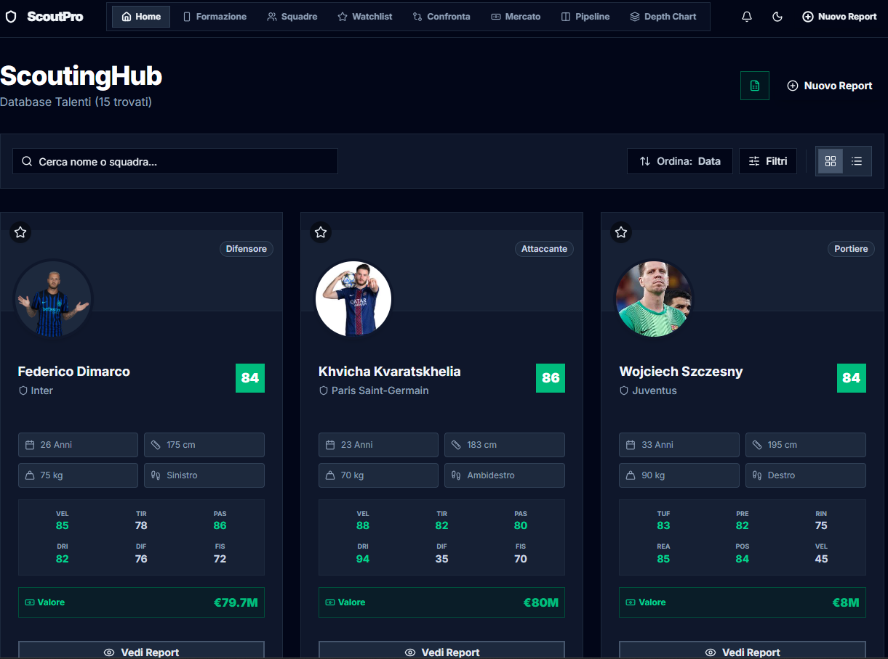
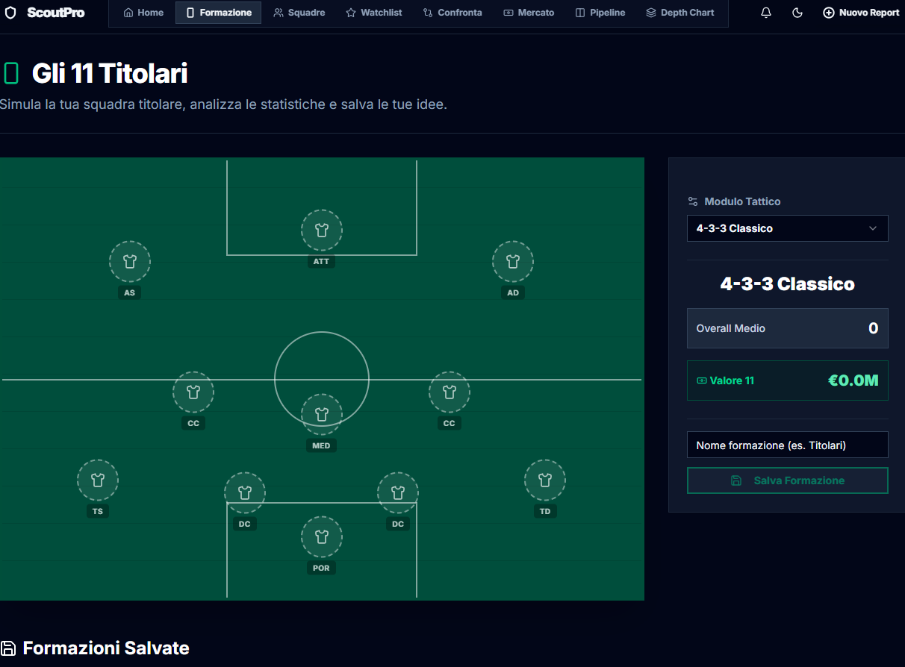
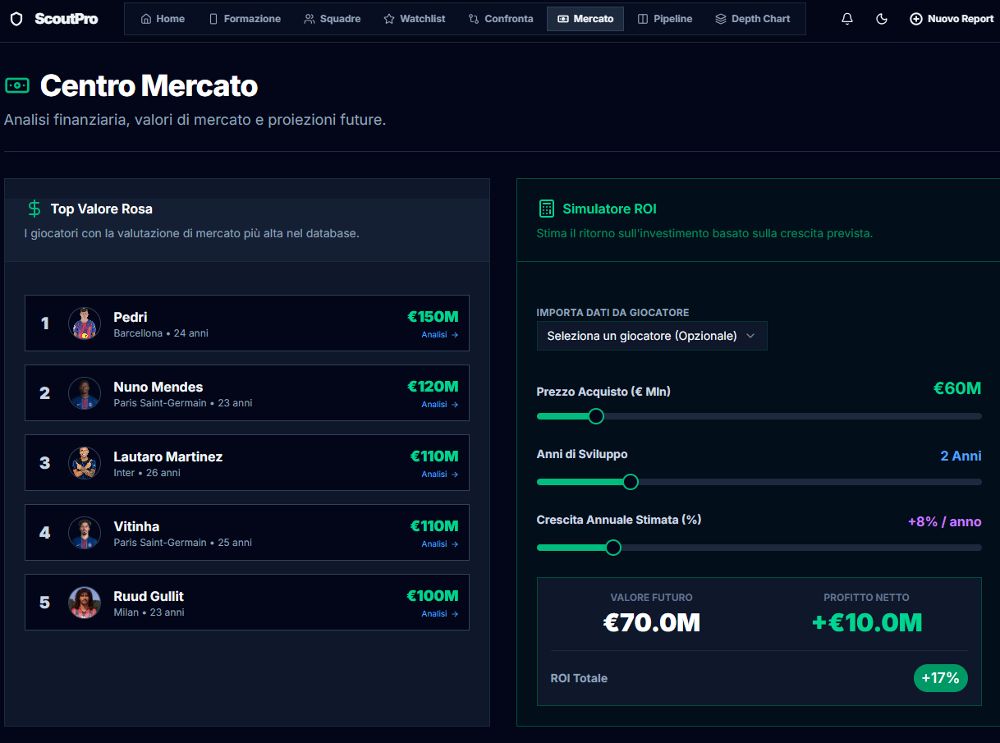
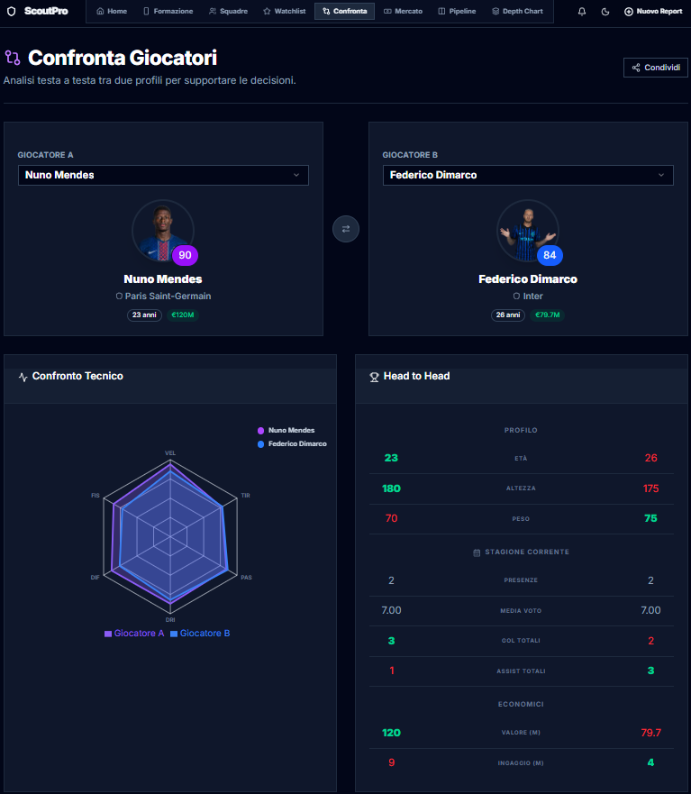

# ScoutPro - Next Gen Football Scouting Platform

**ScoutPro** is a comprehensive full-stack application designed for professional football scouting. It allows scouts and technical directors to manage player databases, analyze performances through dynamic match logs, compare athletes using AI algorithms, and plan market strategies.

Built with performance and user experience in mind, leveraging the latest web technologies.

## Key Features

### Data Analysis & Visualization
* **Dynamic Match Logs:** Track player performance game-by-game. The system automatically calculates seasonal averages (Goals, Assists, Rating, Minutes, Clean Sheets) based on real match reports.
* **Radar Charts:** Visual comparison of player attributes (Pace, Shooting, Dribbling, etc.) using interactive charts.
* **Historical Trends:** Track the evolution of a player's Market Value and Rating over time.
* **PDF Export:** Generate and download professional scouting reports in PDF format with a single click.

### Smart Scouting Tools
* **AI Comparison:** Compare two players side-by-side with an algorithmic "AI Verdict" based on age, potential, cost, and tactical skills.
* **Media Gallery:** Integrated video player to store and watch YouTube/Vimeo highlights directly in the player profile.
* **Excel Import:** Bulk import functionality to migrate legacy data effortlessly.

### Management & Strategy
* **Market Pipeline:** Kanban-style board to track negotiation stages (Scouting, Negotiation, Signed, Rejected).
* **Lineup Builder:** Interactive tactical board to visualize players in different formations (4-3-3, 3-5-2, etc.).
* **Watchlist & Notifications:** Track favorite players and get visual alerts (in the Navbar) for contracts expiring within 6 months.
* **Dark/Light Mode:** Seamless theme switching for optimal viewing in any environment.

## Tech Stack

* **Framework:** [Next.js 14](https://nextjs.org/) (App Router, Server Actions)
* **Language:** [TypeScript](https://www.typescriptlang.org/)
* **Styling:** [Tailwind CSS](https://tailwindcss.com/)
* **Components:** [Shadcn/ui](https://ui.shadcn.com/) + Radix UI
* **Database:** [Prisma ORM](https://www.prisma.io/) (SQLite for Dev / PostgreSQL ready)
* **Forms:** React Hook Form + Zod Validation
* **Charts:** Recharts
* **Animations:** Framer Motion

## Screenshots

| Home | Tactical Lineup |
|:---:|:---:|
|  |  |
| Market Value | Comparare Players |
|  |  |

## Getting Started

Follow these steps to run the project locally:

1.  **Clone the repository**
    ```bash
    git clone [https://github.com/SimoneGricia/ScoutPro.git](https://github.com/SimoneGricia/ScoutPro.git)
    cd ScoutPro
    ```

2.  **Install dependencies**
    ```bash
    npm install
    ```

3.  **Configure Environment**
    Create a `.env` file in the root directory and add your database URL (and other keys if used, like UploadThing or OpenAI):
    ```env
    DATABASE_URL="file:./dev.db"
    ```

4.  **Setup Database**
    ```bash
    npx prisma generate
    npx prisma db push
    ```

5.  **Run the App**
    ```bash
    npm run dev
    ```
    Open [http://localhost:3000](http://localhost:3000) in your browser.

## Contributing

Contributions, issues, and feature requests are welcome! Feel free to check the issues page.

## License

This project is open source.

---

Made by Simone Gricia.